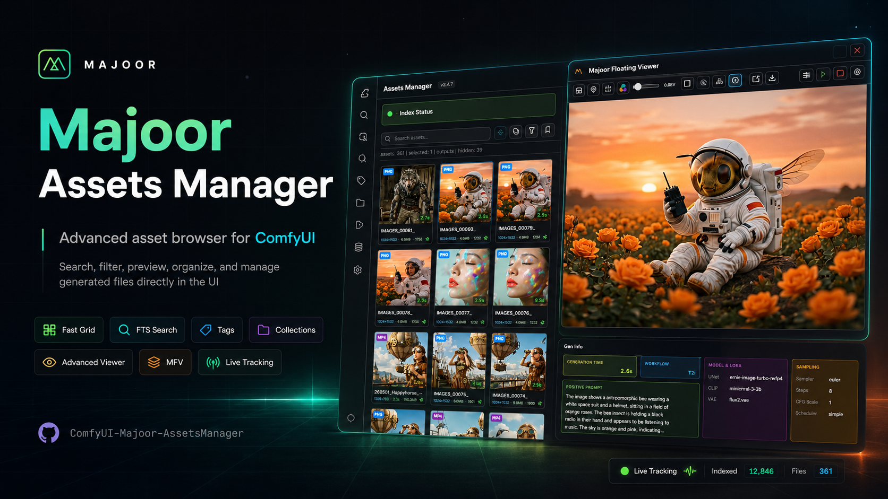
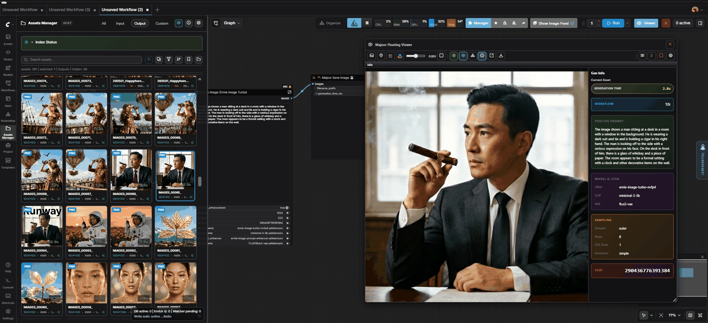
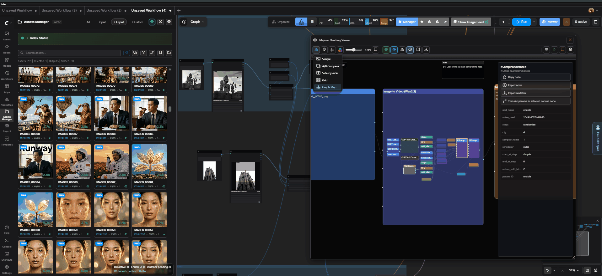

<p align="center">
  
</p>

# Majoor Assets Manager for ComfyUI

[](https://github.com/MajoorWaldi/ComfyUI-Majoor-AssetsManager)
[](https://github.com/MajoorWaldi/ComfyUI-Majoor-AssetsManager/stargazers)
[](https://github.com/MajoorWaldi/ComfyUI-Majoor-AssetsManager/network/members)
[](https://github.com/MajoorWaldi/ComfyUI-Majoor-AssetsManager/issues)
[](LICENSE)
[](https://github.com/MajoorWaldi/ComfyUI-Majoor-AssetsManager/releases)
[](https://github.com/MajoorWaldi/ComfyUI-Majoor-AssetsManager/actions/workflows/python-tests.yml)
[](https://www.python.org/)
[](https://github.com/comfyanonymous/ComfyUI)
[](https://vitest.dev/)
[](https://ko-fi.com/majoorwaldi)

**A media library for ComfyUI outputs, with deep workflow inspection and reuse tools.**

Majoor Assets Manager helps you **browse**, **inspect**, and **reuse** ComfyUI assets without leaving the ComfyUI UI. It is built for large output folders, metadata-heavy workflows, and day-to-day review of generated images, videos, audio, and 3D assets.

## Samples





## Quick Start: 5 Things You Can Do

1. **Browse your outputs**: open the Assets Manager sidebar tab and choose Outputs, Inputs, Custom, or Collections.
2. **Find assets fast**: search by filename, prompt, metadata, type, rating, workflow, date, size, or resolution.
3. **Inspect generation details**: double-click an asset to view media, prompts, workflow metadata, and generation info.
4. **Compare and review**: open the Majoor Floating Viewer for live generations, A/B compare, side-by-side review, pins, and Graph Map workflow inspection.
5. **Reuse assets in ComfyUI**: drag assets to loader nodes or the canvas, use Load Asset, stage files to input, export clean files, or download selected files as a ZIP.

Useful first links:
- User guide: [`user_guide.html`](user_guide.html)
- Documentation index: [`docs/DOCUMENTATION_INDEX.md`](docs/DOCUMENTATION_INDEX.md)
- MFV guide: [`docs/MFV_GUIDE.md`](docs/MFV_GUIDE.md)
- Graph Map guide: [`docs/GRAPH_MAP.md`](docs/GRAPH_MAP.md)
- Changelog: [`CHANGELOG.md`](CHANGELOG.md)

---

## Table of Contents

- [Browse, Inspect, Reuse](#browse-inspect-reuse)
- [Latest Release](#latest-release)
- [Installation](#installation)
- [Basic Usage](#basic-usage)
- [Majoor Floating Viewer (MFV)](#majoor-floating-viewer-mfv)
- [Graph Map](#graph-map)
- [Custom Nodes](#custom-nodes)
- [Hotkeys & Shortcuts](#hotkeys--shortcuts)
- [Advanced Features](#advanced-features)
- [Troubleshooting](#troubleshooting)
- [Development & Testing](#development--testing)
- [Support](#support)

---

## Browse, Inspect, Reuse

### Browse

Use Assets Manager as a fast library for ComfyUI media:
- virtual grid browsing for large output folders
- Outputs, Inputs, Custom roots, and Collections scopes
- full-text search and structured filters
- ratings, tags, collections, duplicate awareness, and generation stacks
- right-click actions for rename, delete, open folder, copy path, download, and ZIP export

### Inspect

Open assets when you need to understand how they were made:
- image, video, audio, and 3D preview surfaces
- prompts, workflow metadata, generation info, and timing details
- Majoor Floating Viewer for live review, A/B comparison, pins, and streams
- Graph Map for readable workflow navigation and node detail inspection

### Reuse

Move useful assets and workflow context back into ComfyUI:
- drag assets to compatible loader nodes or the canvas
- use **Load Asset** to create loader nodes from selected media
- stage files into the ComfyUI input directory
- import or inspect embedded workflows without losing the current review flow
- export originals, clean metadata-stripped files, or selected files as a ZIP

---

## Latest Release

### v2.4.8 Highlights
- **Grid performance improvements**: Better responsiveness, scrolling stability, and asset loading for large libraries.
- **Floating Viewer is now a richer workflow surface**: Inspect, compare, stream, and control generation assets from MFV.
- **Node Stream**: Follow supported selected-node previews directly inside the Floating Viewer.
- **Node Parameters**: Inspect and edit node widgets from the viewer without switching back to the canvas.
- **Toolbox updates**: Faster access to common asset and workflow operations.

See [CHANGELOG.md](CHANGELOG.md) for the complete release notes.

---

## Installation

### Method A: ComfyUI Manager (Recommended)

1. Open **ComfyUI Manager** in your browser
2. Search for **"Majoor Assets Manager"**
3. Click **Install**, then restart ComfyUI completely
4. The extension appears in the sidebar as a folder icon

### Method B: Manual Installation

```bash
# Navigate to ComfyUI custom_nodes directory
cd ComfyUI/custom_nodes

# Clone the repository
git clone https://github.com/MajoorWaldi/ComfyUI-Majoor-AssetsManager ComfyUI-Majoor-AssetsManager

# Install Python dependencies
cd ComfyUI-Majoor-AssetsManager
pip install -r requirements.txt

# Optional: install AI/vector features
# pip install -r requirements.txt -r requirements-vector.txt

# Optional: install contributor tooling
# pip install -r requirements-dev.txt

# Restart ComfyUI
```

Dependency ownership is documented in [`docs/DEPENDENCY_POLICY.md`](docs/DEPENDENCY_POLICY.md). `requirements.txt` is the primary source of truth, `requirements-vector.txt` layers optional AI/vector dependencies on top, and `requirements-dev.txt` is reserved for contributor tooling.

### Optional Dependencies (Highly Recommended)

For full metadata extraction and media probing:

#### Windows
```powershell
# Using Scoop
scoop install ffmpeg exiftool

# OR using Chocolatey
choco install -y ffmpeg exiftool

# OR using WinGet
winget install -e --id Gyan.FFmpeg
winget install -e --id OliverBetz.ExifTool
```

#### macOS
```bash
brew install ffmpeg exiftool
```

#### Linux
```bash
# Ubuntu/Debian
sudo apt update
sudo apt install -y ffmpeg libimage-exiftool-perl

# Fedora/RHEL
sudo dnf install -y ffmpeg perl-Image-ExifTool

# Arch Linux
sudo pacman -S ffmpeg exiftool
```

Verify installation:
```bash
exiftool -ver
ffprobe -version
```

See [`docs/INSTALLATION.md`](docs/INSTALLATION.md) for detailed instructions.

### ComfyUI Desktop Popup Workaround

If you use the official **ComfyUI Desktop / Electron** build and want the **Majoor Floating Viewer** to open in a real detachable window that can be moved to another monitor, the Desktop host must allow `window.open("about:blank")` popups.

The Majoor plugin already tries to open a real popup first on Desktop. Some Desktop builds still block that popup in the Electron host and redirect it to the OS instead. If that happens, use the advanced workaround in [`docs/DESKTOP_POPUP_WORKAROUND.md`](docs/DESKTOP_POPUP_WORKAROUND.md). Browser-based ComfyUI does not require this Electron host patch.

---

## Custom Nodes

Majoor Assets Manager ships two ComfyUI nodes that persist **generation timing metadata** directly inside the saved files. This allows the asset manager to index `generation_time_ms` alongside prompt/workflow data for every asset.

Full reference: [`docs/CUSTOM_NODES.md`](docs/CUSTOM_NODES.md)

The video node requires PyAV. It is included in the runtime dependency contract (`requirements.txt` and `pyproject.toml`) so the documented manual install commands install it automatically.

### Majoor Save Image 💾

Drop-in replacement for the built-in **SaveImage** node. Saves PNG files with `generation_time_ms` embedded in the PNG text chunks.

| Input | Type | Required | Default | Description |
|-------|------|----------|---------|-------------|
| `images` | IMAGE | ✅ | — | The image batch to save |
| `filename_prefix` | STRING | ✅ | `Majoor` | Filename prefix (supports ComfyUI `%date%` placeholders) |
| `generation_time_ms` | INT | ❌ | `-1` (auto) | Generation time in ms. `-1` = auto-detect from prompt lifecycle |

**Metadata written to each PNG:**
- `prompt` — full ComfyUI prompt graph (JSON)
- `workflow` — full workflow (JSON)
- `generation_time_ms` — elapsed time since prompt start (ms)
- `CreationTime` — ISO timestamp

### Majoor Save Video 🎬

Saves a **VIDEO** input or a batch of **IMAGE** frames as a video file. Supports MP4 (h264 via PyAV), GIF, and WebP.

| Input | Type | Required | Default | Description |
|-------|------|----------|---------|-------------|
| `filename_prefix` | STRING | ✅ | `MajoorVideo` | Filename prefix |
| `format` | COMBO | ✅ | `mp4 (h264)` | Output format: `mp4 (h264)`, `gif`, `webp` |
| `images` | IMAGE | ❌ | — | Batch of frames (alternative to `video`) |
| `video` | VIDEO | ❌ | — | A VIDEO input from LoadVideo/CreateVideo |
| `frame_rate` | FLOAT | ❌ | `24.0` | FPS (ignored when VIDEO input carries its own rate) |
| `loop_count` | INT | ❌ | `0` | Loop count for GIF/WebP (0 = infinite) |
| `generation_time_ms` | INT | ❌ | `-1` (auto) | Generation time in ms. `-1` = auto-detect |
| `audio` | AUDIO | ❌ | — | Audio track to mux into MP4 |
| `crf` | INT | ❌ | `19` | Constant Rate Factor (0-63, lower = higher quality) |
| `save_first_frame` | BOOLEAN | ❌ | `true` | Save a PNG sidecar of the first frame with full metadata |

**MP4 container metadata:**
- `prompt`, `workflow`, `generation_time_ms`, `CreationTime` — written via PyAV with `movflags=use_metadata_tags`

**Notes:**
- At least one of `images` or `video` must be connected
- When a `video` input is connected, its native frame rate and audio are used automatically
- GIF/WebP outputs rely on the PNG sidecar for metadata persistence

### Auto-Detection of `generation_time_ms`

When `generation_time_ms` is left at `-1` (default), the node reads the prompt start time from Majoor's `runtime_activity` module, which hooks into the ComfyUI prompt lifecycle. This gives an accurate wall-clock measurement of generation time without any manual wiring.

If the Majoor nodes are **not** used, the asset manager falls back to its standard metadata extraction (EXIF dates, prompt graph analysis, etc.).

---

## Basic Usage

### First Steps
1. **Open Assets Manager**: Click the folder icon in ComfyUI sidebar
2. **Choose Scope**: Select Outputs, Inputs, Custom, or Collections
3. **Browse Assets**: Scroll through the grid view with virtual scrolling
4. **Search**: Type in the search bar for full-text search
5. **Filter**: Use dropdowns for kind, rating, workflow, date filters

### Asset Operations (Right-Click Menu)
- **Open in Viewer**: Double-click or right-click → Open in Viewer
- **Rate**: Assign 0-5 stars
- **Edit Tags**: Add/remove custom tags
- **Add to Collection**: Save to existing or new collection
- **Rename**: Change filename
- **Delete**: Remove asset (with confirmation)
- **Open in Folder**: Show in file explorer
- **Copy Path**: Copy full file path to clipboard
- **Stage to Input**: Copy to ComfyUI input directory

### Collections
1. Select assets (Ctrl/Cmd+click for multiple)
2. Right-click → **Add to Collection**
3. Create new or add to existing collection
4. Access via **Collections** scope

---

## Majoor Floating Viewer (MFV)

MFV now has a dedicated illustrated guide focused on the real workflow inside the floating viewer: compare modes, A/B/C/D pins, Live Stream, Node Stream, KSampler Preview, Node Parameters, Run / Stop, Pop-out, and the Graph Map companion view.


### Opening the Floating Viewer
- Click the **Floating Viewer** button in the Assets Manager toolbar
- Or use the viewer from the ComfyUI canvas context menu

### Live Stream Mode
- Automatically tracks new generations
- Follows the latest completed output file instead of the currently selected node
- No manual refresh needed

### Compare Modes
- **Simple**: Single asset view
- **A/B Compare**: Fast two-slot comparison
- **Side-by-Side**: View both assets simultaneously
- **Grid**: Review up to four pinned or selected references together

### Node Stream
- Enable Node Stream, then select a compatible node in ComfyUI
- MFV shows the selected node's media when that node exposes a frontend preview
- Useful for preview nodes, loader/save nodes, and compatible live-preview surfaces

### Disable MFV Auto-Open
If the Floating Viewer opens automatically during renders or after clicking nodes, turn off the stream features that trigger it:

1. Open **Settings** → **Majoor Assets Manager** → **Viewer**.
2. Disable **Majoor: MFV Live Stream Enabled by Default** to stop MFV from auto-following final render outputs when a generation finishes.
3. Disable **Majoor: MFV KSampler Preview Enabled by Default** to stop MFV from auto-opening for sampler/denoising preview frames during a render.
4. In the Floating Viewer toolbar, turn **Node Stream** off if node clicks are making MFV follow selected-node previews.

You can still open MFV manually with the toolbar button or the **V** shortcut after disabling these defaults.

### Why MFV And Graph Map Work Together
- Use **MFV** for live review, compare, pins, streams, and quick reruns.
- Open **Graph Map** when you need workflow context for the current asset.
- Move from visual review to readable node and subgraph inspection without leaving the viewer workflow.

See [`docs/MFV_GUIDE.md`](docs/MFV_GUIDE.md) for the dedicated MFV guide, [`docs/GRAPH_MAP.md`](docs/GRAPH_MAP.md) for the full workflow-map walkthrough, and [`docs/VIEWER_FEATURE_TUTORIAL.md`](docs/VIEWER_FEATURE_TUTORIAL.md) for the broader viewer documentation.

---

## Graph Map

Graph Map is the workflow navigation view inside the Floating Viewer. It keeps the asset preview, the saved workflow, and the selected node details together so you can understand where a result came from without leaving the viewer.


- **Readable workflow view**: node labels stay visible and named subgraphs show their real names instead of raw UUID/hash identifiers.
- **Direct node inspection**: click a node to open copyable parameters and actions such as copy node, import node, import workflow, or transfer params.
- **Viewer-friendly preview**: the small media preview stays in place while Graph Map refreshes, which is especially useful for video assets.

For the full walkthrough and the second screenshot focused on the node detail panel, see [`docs/GRAPH_MAP.md`](docs/GRAPH_MAP.md).

### Controls
- **Zoom**: Mouse wheel
- **Pan**: Click and drag
- **Move Panel**: Drag from panel header
- **Resize**: Drag panel edges
- **Close**: ESC or close button
- **Focused Player Shortcuts**: Click once on the inline player, then use **Space** to play/pause and **Left/Right** to step frame by frame

---

## Hotkeys & Shortcuts

### Global / Panel
| Shortcut | Action |
|----------|--------|
| **Ctrl+S** / **Cmd+S** | Trigger index scan |
| **Ctrl+F** / **Ctrl+K** | Focus search input |
| **Ctrl+H** | Clear search input |
| **D** | Toggle sidebar (details) |
| **V** | Toggle Floating Viewer |

### Grid View
| Shortcut | Action |
|----------|--------|
| **Arrow Keys** | Navigate selection |
| **Enter** / **Space** | Open Viewer |
| **V** | Open selected asset in Floating Viewer |
| **S** | Download selected asset |
| **Ctrl+A** | Select all |
| **Ctrl+D** | Deselect all |
| **Ctrl+Click** | Toggle selection |
| **Shift+Click** | Range selection |
| **0-5** | Set rating (0-5 stars) |
| **T** | Edit tags |
| **B** | Add to collection |
| **F2** | Rename file |
| **Delete** | Delete file |

### Viewer
| Shortcut | Action |
|----------|--------|
| **Esc** | Close viewer |
| **F** | Toggle fullscreen |
| **D** | Toggle info panel |
| **Space** | Play/pause video |
| **S** | Download original from context menu |
| **Left/Right** | Previous/next asset, or step frame when the focused player bar is active |
| **Mouse Wheel** | Zoom in/out |
| **I** | Toggle pixel probe |
| **C** | Copy probed color |
| **L** | Toggle loupe |
| **Z** | Toggle zebra patterns |
| **G** | Cycle grid overlays |
| **Alt+1** | Toggle 1:1 pixel view |

### Drag & Drop
| Gesture | Action |
|---------|--------|
| **S+Drag to OS** | Export clean copy/ZIP without ComfyUI metadata |
| **L+Drop on canvas** | Load selected asset(s) by creating matching media loader node(s) |

### MFV
| Shortcut | Action |
|----------|--------|
| **Esc** | Close Floating Viewer |
| **V** | Toggle Floating Viewer |
| **C** | Cycle quick compare modes: Simple, A/B, Side-by-Side |
| **K** | Toggle KSampler Preview |
| **L** | Toggle Live Stream |
| **N** | Toggle Node Stream |
| **Space** | Play/pause the focused inline player |
| **Left/Right** | Step frame when the focused inline player is active |

See [`docs/HOTKEYS_SHORTCUTS.md`](docs/HOTKEYS_SHORTCUTS.md) and [`docs/SHORTCUTS.md`](docs/SHORTCUTS.md) for complete lists.

---

## Advanced Features

The README focuses on the user workflow. Detailed reference material lives in the docs folder so new users do not have to read every subsystem before using the extension.

### AI And Vector Search

Optional AI features add semantic search, visual similarity, auto-tags, captions, prompt alignment, and smart collection suggestions. They require additional model dependencies and a vector backfill step for best coverage.

Read: [`docs/AI_FEATURES.md`](docs/AI_FEATURES.md)

### Privacy And Offline Use

AI inference is designed to run locally. Internet access is mainly needed for the first model download from HuggingFace, and cached models can be used offline afterward.

Read: [`docs/PRIVACY_OFFLINE.md`](docs/PRIVACY_OFFLINE.md)

### Configuration And Security

Most users can use the default local setup. Remote access, API tokens, safe-mode write controls, index directory overrides, and environment variables are documented separately.

Read:
- [`docs/SETTINGS_CONFIGURATION.md`](docs/SETTINGS_CONFIGURATION.md)
- [`docs/SECURITY_ENV_VARS.md`](docs/SECURITY_ENV_VARS.md)
- [`docs/THREAT_MODEL.md`](docs/THREAT_MODEL.md)

### API, Database, And Maintenance

Backend endpoint details, database recovery, index reset, and contributor architecture notes are available as advanced references.

Read:
- [`docs/API_REFERENCE.md`](docs/API_REFERENCE.md)
- [`docs/DB_MAINTENANCE.md`](docs/DB_MAINTENANCE.md)
- [`docs/ARCHITECTURE_MAP.md`](docs/ARCHITECTURE_MAP.md)
- [`docs/TESTING.md`](docs/TESTING.md)

---
## Troubleshooting

### Extension Not Appearing
- Verify installation in `custom_nodes/ComfyUI-Majoor-AssetsManager`
- Check ComfyUI console for import errors
- Ensure core dependencies are installed: `pip install -r requirements.txt`
- If you use AI/vector features, also install: `pip install -r requirements.txt -r requirements-vector.txt`
- Restart ComfyUI completely

### Database Corruption
If the index database is corrupted:

**Option 1: Use Delete DB Button** (Recommended)
1. Open Assets Manager → Index Status section
2. Click **Delete DB** button
3. Confirm the warning dialog
4. Database rebuilds automatically

**Option 2: Manual Recovery**
1. Stop ComfyUI completely
2. Navigate to `<output>/_mjr_index/`
3. Delete `assets.sqlite`, `assets.sqlite-wal`, `assets.sqlite-shm`
4. Restart ComfyUI

See [`docs/DB_MAINTENANCE.md`](docs/DB_MAINTENANCE.md) for detailed recovery procedures.

### External Tools Not Found
- Verify installation: `exiftool -ver` and `ffprobe -version`
- Check if tools are in system PATH
- Set environment variables for explicit paths
- Restart ComfyUI after installing tools

### Slow Performance
- First scan of large directories takes time (incremental indexing helps)
- Reduce page size in settings for lower memory usage
- Exclude very large directories from custom roots
- Ensure SSD storage for better database performance

### Search Not Working
- Trigger manual scan with **Ctrl+S**
- Verify the correct scope is selected
- Check if directory has been indexed (status indicator)
- Clear browser cache and reload

### Drag & Drop Issues
- Verify browser supports HTML5 drag & drop
- Check file permissions for source files
- For multi-select ZIP, ensure sufficient disk space
- Try a different browser if issues persist

### API / Remote Access
- Set `MAJOOR_API_TOKEN` for secure remote access
- Configure `MAJOOR_TRUSTED_PROXIES` if behind reverse proxy
- Check firewall settings for ComfyUI port
- Verify CORS settings if accessing from different origin

---

## Development & Testing

### Dependency Setup
```bash
# Runtime-only install
pip install -r requirements.txt

# Runtime + optional AI/vector features
pip install -r requirements.txt -r requirements-vector.txt

# Contributor tooling (tests, lint, typing, security checks)
pip install -r requirements-dev.txt

# Frontend tooling
npm ci
```

Dependency roles and update rules are defined in [`docs/DEPENDENCY_POLICY.md`](docs/DEPENDENCY_POLICY.md).

### Project Structure
```
ComfyUI-Majoor-AssetsManager/
├── __init__.py                 # Extension entry point
├── js/                         # Frontend (Vue 3 + Pinia, vanilla JS)
│   ├── entry.js               # Main entry
│   ├── app/                   # App initialization, settings
│   ├── components/            # UI components
│   ├── features/              # Feature modules
│   ├── stores/                # Pinia stores
│   ├── api/                   # API client
│   └── vue/                   # Vue.js source modules
├── mjr_am_backend/            # Backend (Python)
│   ├── routes/                # API routes, route_catalog.py (declarative)
│   ├── routes/core/           # Shared HTTP helpers (security, path, JSON)
│   ├── routes/assets/         # Thin compat facades → features/assets/
│   ├── features/assets/       # Asset domain: 9 sub-services
│   ├── features/              # Other backend features
│   ├── adapters/db/           # SQLite: facade + split sub-modules
│   └── shared.py              # Shared backend helpers
├── mjr_am_shared/             # Shared code (frontend/backend)
├── tests/                     # Test suites
│   ├── core/                  # Core functionality tests
│   ├── metadata/              # Metadata extraction tests
│   ├── features/              # Feature tests
│   ├── database/              # Database tests
│   └── security/              # Security tests
├── docs/                      # Documentation
└── scripts/                   # Utility scripts
```

> For detailed architecture and module responsibilities, see [docs/ARCHITECTURE_MAP.md](docs/ARCHITECTURE_MAP.md).

### Running Tests

#### Backend Tests (pytest)
```bash
# All tests
python -m pytest tests/ -q

# Single test file
python -m pytest tests/core/test_routes.py -v

# Single test function
python -m pytest tests/core/test_routes.py::test_routes -v

# With coverage
pytest tests/ --cov=mjr_am_backend --cov-report=html
```

#### Frontend Tests (Vitest)
```bash
# Run JavaScript tests
npm run test:js

# Watch mode
npm run test:js:watch
```

#### Windows Batch Runners
```bat
# Full test suite
run_tests.bat

# With JUnit XML and HTML reports
tests/run_tests_all.bat
```

Test reports: `tests/__reports__/index.html`

### Code Quality
```bash
# Install local git hooks once
python scripts/install_local_hooks.py

# Canonical repo quality gate
python scripts/run_quality_gate.py

# Fast Python-only gate
python scripts/run_quality_gate.py --python-only --skip-tests

# Fast local pre-push equivalent on changed files
python scripts/run_changed_quality_gate.py

# Individual checks
mypy --config-file mypy.ini
python -m ruff check mjr_am_backend mjr_am_shared tests scripts __init__.py
bandit -r mjr_am_backend -ll -ii -x tests
pip-audit -r requirements.txt
python scripts/check_cc_changed.py

# Optional auto-fix
python -m ruff check --fix mjr_am_backend mjr_am_shared tests scripts __init__.py
```

### Contributing
1. Fork the repository
2. Create a feature branch
3. Install contributor dependencies: `pip install -r requirements-dev.txt`
4. Install local hooks: `python scripts/install_local_hooks.py`
5. Make your changes
6. Run tests: `run_tests.bat`
7. Submit a pull request

See [`docs/TESTING.md`](docs/TESTING.md), [`tests/README.md`](tests/README.md), and [`docs/DEPENDENCY_POLICY.md`](docs/DEPENDENCY_POLICY.md) for detailed contributor guidance.

---

## Data Locations

| Data Type | Location |
|-----------|----------|
| Index Database | `<output>/_mjr_index/assets.sqlite` |
| Custom Roots Config | `<output>/_mjr_index/custom_roots.json` |
| Collections | `<output>/_mjr_index/collections/*.json` |
| Temp Batch ZIPs | `<output>/_mjr_batch_zips/` |
| Browser Settings | `localStorage.mjrSettings` |

---

## Compatibility

- **ComfyUI**: ≥ 0.13.0 (recommended baseline)
- **Python**: 3.10, 3.11, 3.12, 3.13
- **Operating Systems**:
  - Windows 10/11
  - macOS 10.15+
  - Linux (Ubuntu 22.04+, Fedora, Debian)
- **Browsers**: Modern browsers with ES2020+ support

---

## Support

### Documentation
- 📚 [Documentation Index](docs/DOCUMENTATION_INDEX.md)
- 🔐 [Privacy / Offline Guide](docs/PRIVACY_OFFLINE.md)
- 📖 [User Guide (HTML)](user_guide.html)
- 🔧 [API Reference](docs/API_REFERENCE.md)
- 🛠️ [Installation Guide](docs/INSTALLATION.md)
- ⚙️ [Settings & Configuration](docs/SETTINGS_CONFIGURATION.md)
- 🔒 [Security Model](docs/SECURITY_ENV_VARS.md)
- 🗄️ [Database Maintenance](docs/DB_MAINTENANCE.md)
- 🎯 [Viewer Tutorial](docs/VIEWER_FEATURE_TUTORIAL.md)
- 🏷️ [Ratings & Tags](docs/RATINGS_TAGS_COLLECTIONS.md)
- 🔍 [Search & Filtering](docs/SEARCH_FILTERING.md)
- 🎹 [Hotkeys & Shortcuts](docs/HOTKEYS_SHORTCUTS.md)
- 📦 [Drag & Drop](docs/DRAG_DROP.md)
- 🧪 [Testing Guide](docs/TESTING.md)

### Community
- 🐛 [Report Issues](https://github.com/MajoorWaldi/ComfyUI-Majoor-AssetsManager/issues)
- 💡 Use GitHub Issues for bug reports, support requests, and security/privacy questions
- ☕ [Support the Developer](https://ko-fi.com/majoorwaldi)

### Notes
- GitHub Discussions may not be enabled or available at all times for this repository.
- If the Discussions link is unavailable, please open an Issue instead.

### Troubleshooting Resources
1. Check ComfyUI console for error messages
2. Review relevant documentation sections above
3. Search existing GitHub issues
4. Verify external tools installation
5. Try resetting/deleting the database

---

## License

Copyright (c) 2026 Ewald ALOEBOETOE (MajoorWaldi)

Licensed under the **GNU General Public License v3.0** ([`LICENSE`](LICENSE)).

Optional attribution request: See [`NOTICE`](NOTICE) file for details.

---

## Acknowledgments

- ComfyUI team for the amazing node-based UI
- ComfyUI Manager for easy extension distribution
- ExifTool and FFprobe developers for metadata extraction
- Vue.js team for the frontend framework
- All contributors and users of this extension

---

*Last updated: May 18, 2026*
*Version: 2.4.8*
